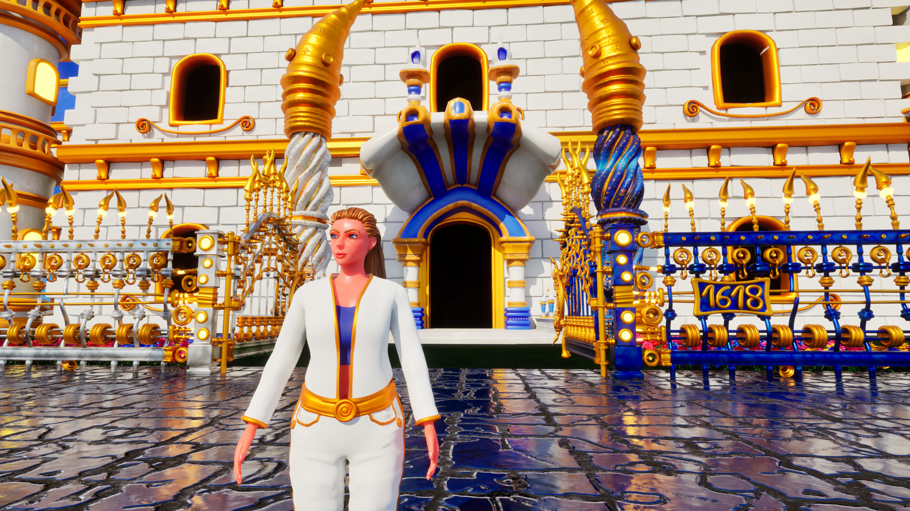

<!--  URL: https://github.com/Goldanniyatech/Goldanniyatech -->
# Yoann AMAR ASSOULINE | [Goldanniyatech](https://www.goldanniyatech.com/)

Hello there 😎! I'm a **3D Game Developer**, **Computer Science Instructor**, **PhD in Semiotics**, and **Founder of Goldanniyatech**.

With over 20 years of practice in computer science, including 15 years of professional experience, I have been passionate about 3D game development since a young age, having started as a as a self-taught developer at 14, back in 2004.

In 2021, I also founded my company, Goldanniyatech, in order to develop my game Goldanniyatech entirely solo and from scratch (no AI), as well as to share my expertise as a computer science instructor.

## Wishlist my Game

**Goldanniyatech** is a 3D action‑adventure open‑world game that I am creating entirely alone and from scratch using **Blender**, **Unreal Engine** (Blueprints and C++), and other tools.

💠 [Steam](https://store.steampowered.com/app/3585280/Goldanniyatech/) 

💠 [Epic Games](https://store.epicgames.com/p/goldanniyatech-a0c4db)

## Visit my Website 

💠 Check [Goldanniyatech.com](https://www.goldanniyatech.com/) for details about my game, my work, and my company. 
